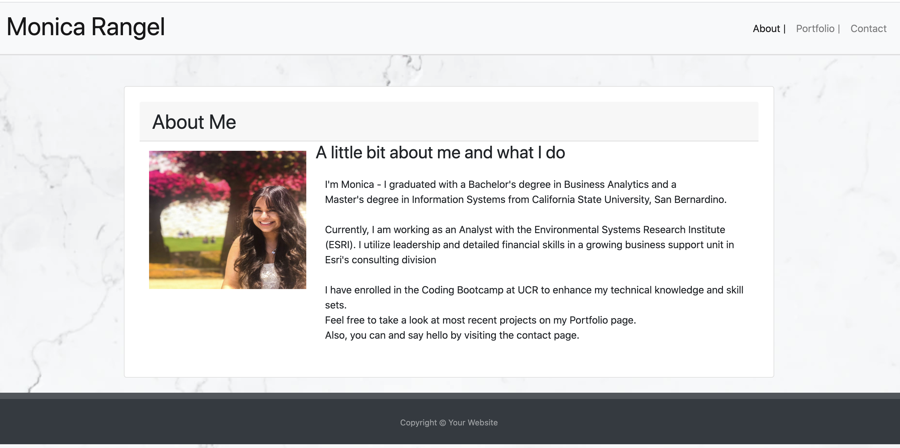

# Responsive Portfolio
## Overview
For this project, I've developed a portfolio template that is responsive to multiple size displays.

## Purpose:
The portfolio must include a responsive layout, navbar, and images using Bootstrap.

## Requirements:
1. Navbars on each page.
2. All links must work properly.
3. Semantic HTML must be used.
4. Page links work correctly.
5. Properly use Bootstrap components.
6. Must contain valid HTML.

## Project Overview
